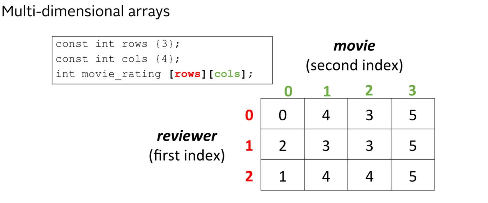

<div><h1 align=center> 04- Arrays and Vectors</h1></div>  

---  
## Arrays:
- An array is a compound data type or a structured data type that can hold multiple values of the same type.
- The values in an array are stored in contiguous memory locations.
- Each value in an array is called an element, and each element can be accessed using its index.
- The index of the first element in an array is 0, the index of the second element is 1, and so on. And the last element is at index n-1, where n is the number of elements in the array.
- The size of an array must be specified at the time of declaration and cannot be changed later.
- Arrays can be single-dimensional or multi-dimensional.
- The size of an Array is fixed at compile time.
- Array elements can be accessed and modified individually using their index.
- Arrays are bound-checked at runtime, meaning that accessing an element outside the bounds of the array can lead to undefined behavior.
- Arrays can be initialized at the time of declaration or later in the code.  

**Declaring an Array:**
```c++
        Element_Type array_name [constant number of elements];
 
 int test_scores [4];
 
 int high_score_per_grade [10];
 
 const int months_in_year {12};
 double loan_payments [months_in_year];
```
**Initializing an Array:**
```c++
        Element_Type array_name [number of elements] {init list};

int test_scores [5] {63, 72, 89, 91, 84};

int highh_score_per_grade [10] {33, 40, 60}; // remaining elements are initialized to 0

const double months_in_year {12};
double loan_payments [months_in_year] {0}; // all elements are initialized to 0.0

int another_array [] {8,3,5,2,1,0} ; // size is determined by the number of elements in the init list
```
**Syntax for Accessing array elements:**
```c++
        array_name [element_index]
        test_scores [1]
        // also known as array subscripting
        
       int test_scores [5] {63, 72, 89, 91, 84};

       cout << "First score at index 0: " << test_scores [0] << endl;
       cout << "Second score at index 1: " << test_scores [1] << endl;
       cout << "Third score at index 2: " << test_scores [2] << endl;
       cout << "Fourth score at index 3: " << test_scores [3] << endl;
       cout << "Fifth score at index 4: " << test_scores [4] << endl;
       
       //changing an element
       
       cin >> test_scores [0];
       cin >> test_scores [1]
       cin >> test_scores [2];
       
       test_scores [1] = 90; // storing an element
```
**How does an array work in memory?**
- The name of the array represents the address of the first element in the array (index 0).
- The [index] represents the offset from the base/beginning of the array.
- The compiler used the sizeof operator to determine where the next element is located in memory.
- C++ does not perform bounds checking on arrays. Accessing an element outside the bounds of the array can lead to undefined behavior.

## Multi-dimensional Arrays:
**Declaring multi-dimensional arrays:**
```c++
    Element_Type array_name [dim1_size] [dim2_size]...[dimN_size];
    
    int anime_rating  [3] [4];  // 3 rows and 4 columns which is 12 integers
```
**Visual Example of 2D Arrays:**  


**Accessing element in multi-dimensional arrays:**
```c++
 cin >> movie_rating [2]] [1];  // accessing the element in 3rd row and 2nd column
 cout <<  movie_rating [2] [1]; // prints the element in 3rd row and 2nd column
```
**Initializing multi-dimensional arrays:**
```c++
     Element_Type array_name [dim1_size] [dim2_size]...[dimN_size] {init_list};
 
int movie_rating [3] [4] { 
     {0, 1, 2, 3}, 
     {1, 2, 3, 4}, 
     {2, 3, 4, 5} 
};
```
---
## Vectors:
- Vectors are containers in the C++ Standard Template Library (STL) that can hold multiple values of the same type.
- Vectors are dynamic in size, meaning that they can grow or shrink as needed.
- Vectors provides similar semantics and syntax to arrays, but with additional functionality and flexibility.
- Vectors can provide bounds checking at runtime, meaning that accessing an element outside the bounds of the vector will throw an exception.
- Vectors can use function tools like sort, reverse, find, etc. from the STL library.
- vectors are objects, and they have member functions that can be used to manipulate the vector.
- If vectors are called inside [] operator, no bounds checking is performed. It means they won't check the out of bounds.
- Vector subscripting or indexing are the same as array subscripting or indexing.

**Declaring a Vector:**
```c++
        vector <Element_Type> vector_name;

#include <vector>
using namespace std;
      vector <int> test_scores;// empty vector of integers
      vector <double> high_score_per_grade; // empty vector of doubles
      vector <string> student_names; // empty vector of strings
      
      vector <char> vowels (5); // vector of 5 characters, each element is initialized to '\0'
      vector <int> lucky_numbers (10, 7); // vector of 10 integers, each element is initialized to 7
```
**Accessing Vector Elements - array syntax:**
```c++
    vector_name [element_index]
    test_scores [1]; // storing an element

  vector <int> test_scores {100, 98, 89, 76, 84};
    cout << "First score at index 0: " << test_scores [0] << endl;
    cout << "Second score at index 1: " << test_scores [1] << endl;
```
**Accessing Vector Elements - vector syntax:**
```c++
    vector_name.at(element_index)
    test_scores.at(1); // storing an element

  vector <int> test_scores {100, 98, 89, 76, 84};
    cout << "First score at index 0: " << test_scores.at(0) << endl;
    cout << "Second score at index 1: " << test_scores.at(1) << endl;
    
  test_scores.at(3) = 90; // changing the value at index 1
```
**Adding elements to a Vector:**
- Vectors can dynamically grow in size using the `push_back` member function, which automatically adds and allocates memory for a new element at the end of the vector.
```c++
    vector_name.push_back(element);
    test_scores.push_back(95); // adds 95 to the end of the vector

  vector <int> test_scores {100,89,96}; // empty vector
    test_scores.push_back(90); // adds 90 to the end of the vector {100,89,96,90}
    test_scores.push_back(98); // adds 98 to the end of the vector {100,89,96,90,98}
```
**Out of Bounds Access:**
```c++
    vector <int> test_scores {100, 98, 89, 76, 84};
    cout << test_scores.at(10) << endl; // throws an out_of_range exception
    cout << test_scores[10] << endl; // no bounds checking is performed, undefined behavior
```
**Getting the size of a Vector:**
```c++
    vector_name.size();
    test_scores.size(); 
  
  vector <int> test_scores {100, 98, 89, 76, 84};
    cout << "Size of the vector: " << test_scores.size() << endl; // prints 5
```
**Multi-dimensional Vectors:**
```c++
    vector <vector <Element_Type>> vector_name
    {
        {init_list_row1},
        {init_list_row2},
        ...
        {init_list_rowN}
    };
    
  vector <vector <int>> movie_ratings; // empty 2D vector of integers
  vector <vector <double>> high_score_per_grade; // empty 2D vector of doubles  
  vector <vector <string>> student_names; // empty 2D vector of strings
```